# Central Limit Theorem Simulations

This is a project for my probability class exploring the central limit theorem. 

# Uniform Distribution
Using a uniform distribution, we can create histograms of means for various distributions to show that as we take more and more means, this histogram approaches the normal distribution. Let's try this with various values of N where N is the number of samples from an uniform distribution we take and the number of times we take that number of samples. 

## N = 10
mean: 0.4649967817685877 std: 0.1282867527034076
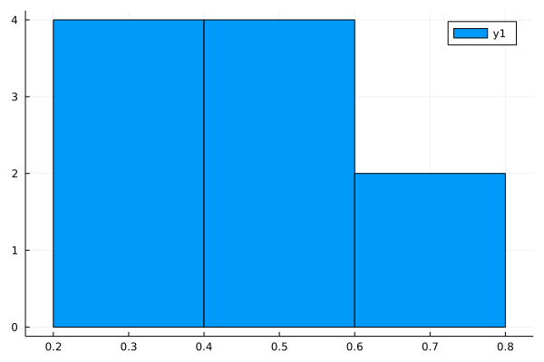

## N = 30 
mean: 0.5085568928657751 std: 0.054875234572984925
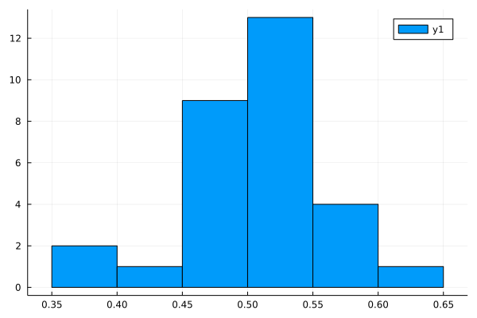

# N = 100 
mean: 0.5031666448232253 std: 0.030373747353650216
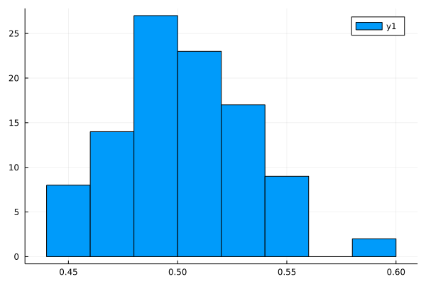

# N = 300
mean: 0.4998262703290153 std: 0.017840476617435277
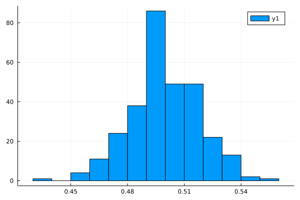

# N = 10000 
mean: 0.4999882636235092 std: 0.002876176349288195
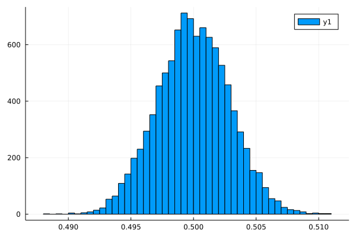

We can pretty clearly see that increasing the number of samples causes the distribution of means to approach the normal distribution.

# Normal Distribution 

Now we can try the normal distribution which, unless something really weird happens, should pretty clearly produce expected results. Here I am using a μ = 0 and σ = 1. 

## N = 10
mean: 0.11080358266635751 std: 0.34257401293029344

## N = 30 
mean: 0.02534673714289707 std: 0.17261836678886003
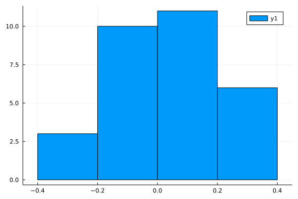

# N = 100 
mean: 0.007708429548395921 std: 0.09571923337168592
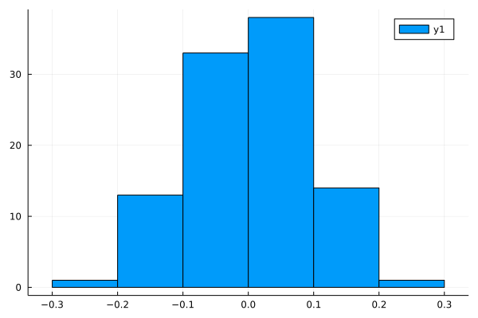

# N = 300
mean: -0.0044609668650971105 std: 0.05868777539706192
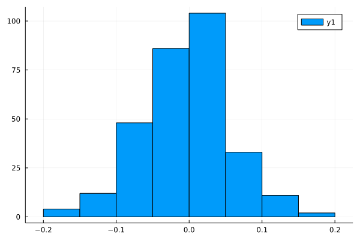

# N = 10000 
mean: 0.00015270394032587995 std: 0.010049697720861145
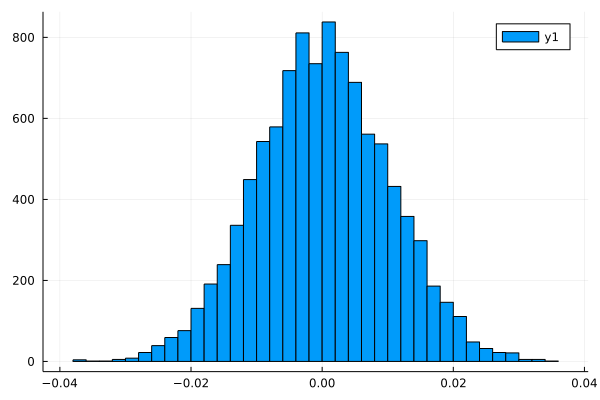

# Exponential Distribution 

We can now try the exponential distribution! Here I am defining θ = 1: 

## N = 10
mean: 0.7693823895652956 std: 0.17267055555459848
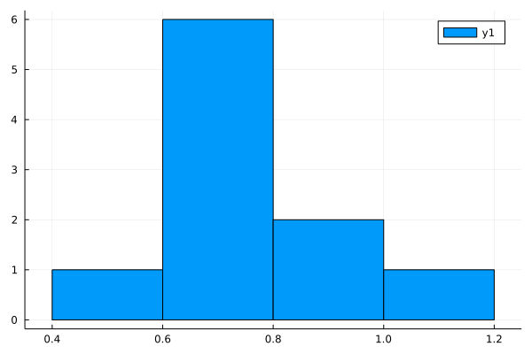

## N = 30 
mean: 0.996809469337324 std: 0.167477533766728
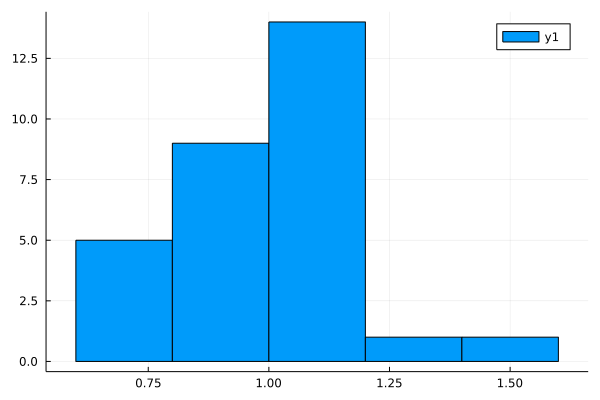

# N = 100 
mean: 0.9985695407705971 std: 0.10434951227925739
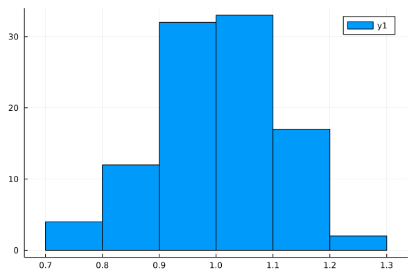

# N = 300
mean: 1.001912810179403 std: 0.05810363597537945
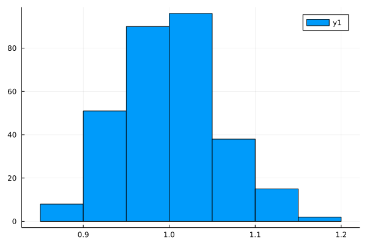

## N = 500 
mean: 0.9964168784847036 std: 0.04344289722129541
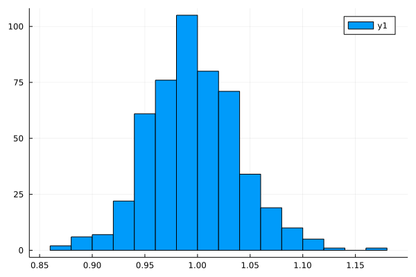

## N = 1000
mean: 1.000974601552286 std: 0.03205228162301302
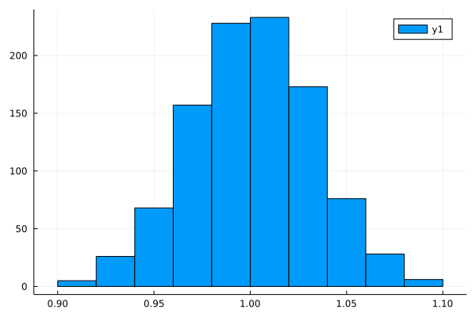

# N = 10000 
mean: 1.0000309820997648 std: 0.01001245960847717
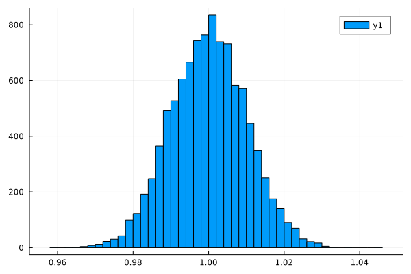

# Gamma Distribution

## N = 10
mean: 1.1685135366950785 std: 0.6503588530784078
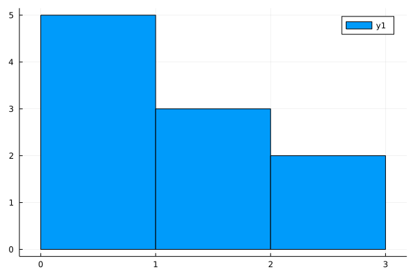

## N = 30 
mean: 0.9731865800966766 std: 0.1732771526657192
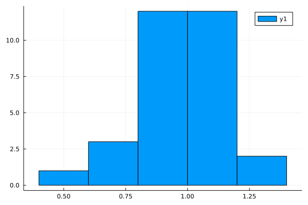

# N = 100 
mean: 0.9947081931941391 std: 0.07926402182792257
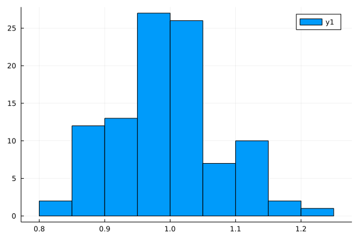

# N = 300
mean: 1.0008326370771714 std: 0.055036495471559845
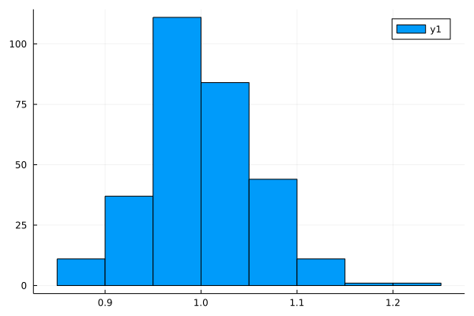

## N = 500 
mean: 0.9968990756515727 std: 0.046725963133929224
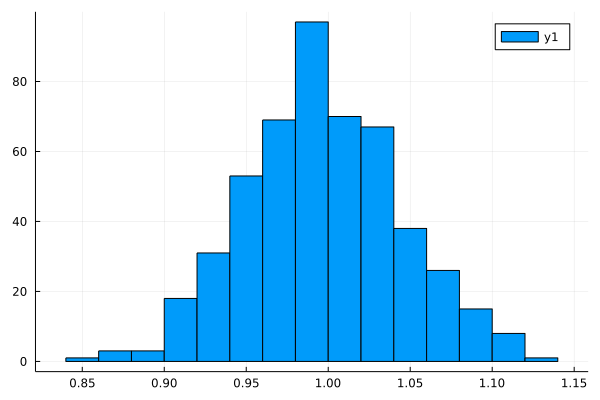

## N = 1000
mean: 0.9990905388172547 std: 0.030162578505430013
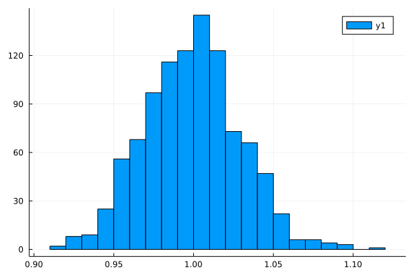

# N = 10000 
mean: 1.000129651037423 std: 0.009906402781831495
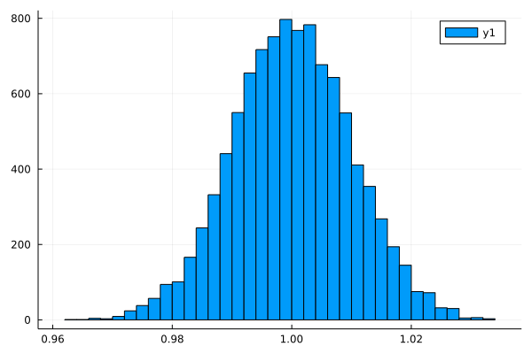

# Observations 

Generally, the larger the N, the closer to a normal distribution we get, and that is expected assuming the ceneral limit theorem. It is very dependent on the distribution for how high of a value for N it takes for this to converge. For example, the uniform and normal distributions showed convergence at 300 ish while the gamma distribution took till 10000 (it was still somewhat skewed at 1000). 

It seems that the higher the value of N, the more the mean of the distribution of means tends towards the expected average of the initial distribution. Which makes sense. The standard deviation also appears to drop to 0, which makes sense when you are taking averages of averages, with enough trials there really shouldn't be that much spread. 